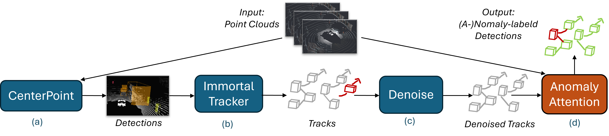

# Track-based Anomaly Detection

<!-- 
  
 -->

## Contact
Any questions or suggestions are welcome! 

Friedrich Dang [friedrich.dang@mail.de](mailto:friedrich.dang@mail.de)

## Abstract

Accurate 3D object detection plays a crucial role in autonomous driving, but labeling large-scale LiDAR datasets remains a resource-intensive challenge. Existing automated labeling methods have shown promise but often face limitations such as high computational costs, reliance on extensive labeled data, and limited focus on rare or underrepresented object classes. To address these challenges, we propose a modular framework for anomaly detection and refinement in LiDAR-based object detection systems, evaluated on the nuScenes dataset.

Our framework combines CenterPoint for initial detections, ImmortalTracker for track generation, and AnomalyAttention for anomaly refinement. In the semi-supervised 5% seed case, the framework achieves a +6.67% mAP improvement, with notable gains in rare classes like Bus (+9.52%) and Bicycle (+8.31%), illustrating its potential in data-scarce conditions. For the fully supervised 100% seed case, it achieves a +0.87% mAP improvement, effectively reducing false positives while retaining nomalies. These results suggest that lightweight and scalable anomaly detection frameworks can support automated 3D data labeling while addressing real-world data constraints.

## Third-party resources

- [ONCE_Benchmark](https://github.com/PointsCoder/ONCE_Benchmark): Implementation of CenterPoint on the ONCE dataset 
- [CenterPoint-KITTI](https://github.com/tianweiy/CenterPoint-KITTI): Reimplementation of CenterPoint on the KITTI dataset 
- [OpenPCDet](https://github.com/open-mmlab/OpenPCDet): Implementation of CenterPoint in OpenPCDet framework (with configs for Waymo/nuScenes dataset)
- [AFDet](https://arxiv.org/abs/2006.12671): another work inspired by CenterNet achieves good performance on KITTI/Waymo dataset
- [mmdetection3d](https://github.com/open-mmlab/mmdetection3d/tree/master/configs/centerpoint): CenterPoint in mmdet framework
- [CenterPointTensorRT](https://github.com/Abraham423/CenterPointTensorRT): CenterPoint-PointPillar for accelerated inference with TensorRT 
- [CenterPoint-ONNX](https://github.com/CarkusL/CenterPoint): Convert CenterPoint-Pillar to ONNX / TensorRT

## Use AnomalyAttention

### Installation

Please refer to [INSTALL](docs/INSTALL.md) from the original [CenterPoint](https://github.com/tianweiy/CenterPoint) repo to set up libraries needed for distributed training and sparse convolution. For this project, a complete list of list of all used packages and their versions can be found in our [requirement.txt](./requirements.txt).

### Training and Evaluation

Please refer to [GETTING_START](docs/GETTING_START.md) to prepare the data. Then follow the instruction there to reproduce our results. All detection configurations are included in [configs](configs).

## Acknowlegement

AnomalyAttention is developed based on a forked version of [CenterPoint](https://github.com/tianweiy/CenterPoint). Note that nuScenes' dataset is under non-commercial licenses. 

This project is not possible without multiple great opensourced codebases. We list some notable examples below.  

* [CenterPoint](https://github.com/tianweiy/CenterPoint)
* [det3d](https://github.com/poodarchu/det3d)
* [second.pytorch](https://github.com/traveller59/second.pytorch)
* [mmcv](https://github.com/open-mmlab/mmcv)
* [mmdetection](https://github.com/open-mmlab/mmdetection)
* [OpenPCDet](https://github.com/open-mmlab/OpenPCDet)

Special thanks to [SetLabs](https://www.setlabs.de/) and TUM's [Department for Cyber Physical Systems](https://www.ce.cit.tum.de/cps/home/) for providing all necessary ressources, and to Max Ronecker (SetLabs) and Tobias Ladner (TUM) guidance for this project.
